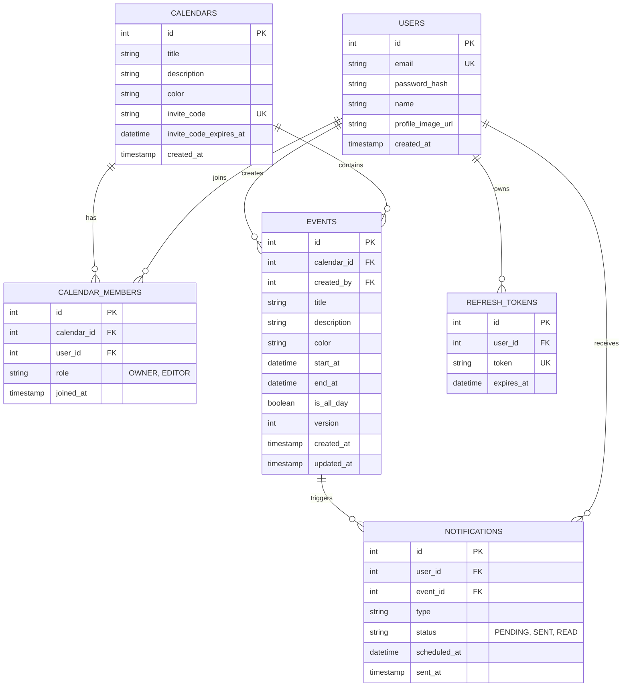

# CalBag - 공유 캘린더 서비스

여러 사용자가 캘린더를 공유하고 일정을 함께 관리할 수 있는 RESTful 백엔드 API 서버입니다.
TimeTree를 레퍼런스로, 실제 사용하며 필수적이라고 느꼈던 **동시 편집 충돌 처리**와 **일정 알림** 두 기능에 집중했습니다.

**개발 기간**: 2026.05 ~ 2026.09 (개인 프로젝트)

## 기술 스택

| 구분 | 기술 |
|------|------|
| Language | Java 17 |
| Framework | Spring Boot 3.5.14 |
| ORM | Spring Data JPA (Hibernate) |
| Database | MySQL 8.0 |
| Auth | Spring Security + JWT |
| Documentation | Swagger (springdoc-openapi) |
| Build | Gradle 8.14 |
| CI | GitHub Actions |

## 기술 선택 이유

- **MySQL** — 유저, 캘린더, 일정 데이터는 관계가 명확하고 영구 저장이 필요하므로 RDBMS를 선택했습니다. 알림 예약 조회도 복합 인덱스로 충분히 처리할 수 있어 별도 저장소 없이 MySQL 하나로 운영합니다. ([설계 재검토](#설계-재검토-redis-알림-큐-제거) 참고)

- **JWT + DB 저장 리프레시 토큰** — API 요청마다 쓰는 액세스 토큰은 서버 상태 없이 검증합니다. 리프레시 토큰만 DB에 저장해 로그아웃과 재사용 차단이 가능하도록 했습니다.

- **낙관적 락** — 충돌 구간이 "일정 조회 → 사용자가 편집 → 저장"으로 두 번의 HTTP 요청에 걸쳐 있어, 요청 단위로 잡히는 DB 락(비관적 락)으로는 이 구간을 보호할 수 없습니다. 또한 같은 일정을 동시에 수정하는 경우는 드물기 때문에, 충돌 시에만 실패시키는 낙관적 락이 적합하다고 판단했습니다.

## ERD



- 캘린더 소유권은 `CALENDAR_MEMBERS.role`로만 관리합니다. 한 캘린더를 여러 사용자가 공유하므로 소유자도 멤버 중 한 명으로 표현했습니다.
- 인덱스: `events (calendar_id, start_at, end_at)`, `notifications (status, scheduled_at)`

## API 목록

인증이 필요한 API는 `Authorization: Bearer {accessToken}` 헤더가 필요합니다.

### Auth
| Method | URL | 설명 |
|--------|-----|------|
| POST | /api/auth/signup | 회원가입 |
| POST | /api/auth/login | 로그인 (액세스/리프레시 토큰 발급) |
| POST | /api/auth/refresh | 토큰 재발급 (리프레시 토큰 회전) |
| POST | /api/auth/logout | 로그아웃 (리프레시 토큰 폐기) |

### Calendar
| Method | URL | 설명 | 권한 |
|--------|-----|------|------|
| GET | /api/calendars | 내 캘린더 목록 조회 | - |
| POST | /api/calendars | 캘린더 생성 (생성자가 OWNER) | - |
| PATCH | /api/calendars/{calendarId} | 캘린더 수정 | OWNER |
| DELETE | /api/calendars/{calendarId} | 캘린더 삭제 (모든 멤버에게서 삭제) | OWNER |
| POST | /api/calendars/{calendarId}/invite-code | 초대 코드 발급 (재발급 시 기존 코드 무효) | OWNER |
| POST | /api/calendars/join | 초대 코드로 참여 (EDITOR로 참여) | - |
| GET | /api/calendars/{calendarId}/members | 멤버 목록 조회 | 멤버 |
| DELETE | /api/calendars/{calendarId}/members/{memberUserId} | 본인이면 나가기, 타인이면 내보내기 | 멤버 / OWNER |

### Event
| Method | URL | 설명 | 권한 |
|--------|-----|------|------|
| GET | /api/calendars/{calendarId}/events?startAt=&endAt= | 기간 내 일정 목록 조회 | 멤버 |
| POST | /api/calendars/{calendarId}/events | 일정 생성 | 멤버 |
| GET | /api/events/{eventId} | 일정 단건 조회 | 멤버 |
| PUT | /api/events/{eventId} | 일정 수정 (낙관적 락) | 멤버 |
| DELETE | /api/events/{eventId} | 일정 삭제 (연결된 알림도 삭제) | 멤버 |

<details>
<summary>일정 수정 요청/응답 예시</summary>

일정 수정 시 요청 body에 조회 시점의 `version`을 포함해야 합니다. DB의 version과 불일치하면 `409 Conflict`를 반환합니다.

**요청**

```json
PUT /api/events/1

{
  "title": "팀 회의",
  "description": "주간 회의",
  "color": "#0000FF",
  "startAt": "2026-06-10T10:00:00",
  "endAt": "2026-06-10T11:00:00",
  "isAllDay": false,
  "version": 3
}
```

**충돌 시 응답 (409 Conflict)**

```json
{
  "success": false,
  "data": null,
  "message": "다른 사용자가 이미 수정했습니다. 다시 시도해주세요."
}
```

</details>

### Notification
| Method | URL | 설명 | 권한 |
|--------|-----|------|------|
| POST | /api/events/{eventId}/notification-settings | 알림 설정 (10분/30분/1시간/1일 전) | 멤버 |
| GET | /api/notifications | 내 알림 목록 조회 | - |
| PATCH | /api/notifications/{notificationId}/read | 알림 읽음 처리 | 본인 |

## 핵심 기능

### 1. 낙관적 락을 활용한 동시 수정 충돌 처리

공유 캘린더에서 여러 사용자가 같은 일정을 동시에 수정할 때, 나중에 저장한 사람이 앞선 수정을 모르고 덮어쓰지 않도록 합니다.

- 조회 응답에 `version`을 포함하고, 수정 요청 시 클라이언트가 본 version과 DB version을 비교해 다르면 409 반환
- 두 요청이 거의 동시에 version 검사를 통과한 경우 JPA `@Version`이 UPDATE 시점에 차단하고, 이 역시 409로 응답

### 2. 일정 알림 스케줄러

- 알림 설정 시 일정 시작 시각 기준으로 예정 시각(`scheduled_at`)을 계산해 저장 (같은 일정에 같은 유형 중복 설정 불가, 이미 지난 시각 불가)
- 1분 주기 `@Scheduled` 작업이 `status = PENDING AND scheduled_at <= now` 알림을 `(status, scheduled_at)` 인덱스로 조회해 발송 처리
- 알림 상태: `PENDING → SENT → READ`

### 3. 초대 코드 기반 캘린더 공유

- OWNER가 8자리 초대 코드를 발급 (`SecureRandom`, 헷갈리는 문자 0/O·1/I 제외, 7일 만료)
- 코드를 입력한 사용자는 EDITOR로 참여하며, 멤버는 모두 일정을 읽고 쓸 수 있음. 캘린더 수정·삭제, 초대, 내보내기는 OWNER만 가능
- OWNER가 나가면 가장 먼저 참여한 멤버에게 OWNER를 자동 승계하고, 남은 멤버가 없으면 캘린더를 삭제
- 멤버가 나가거나 내보내지면 그 사용자가 해당 캘린더에 설정한 알림도 함께 삭제

### 4. 리프레시 토큰 회전

- 토큰에 `type` 클레임(access/refresh)을 넣어, 인증 필터는 액세스 토큰만 허용
- 리프레시 토큰은 DB에 저장하고, 재발급할 때마다 기존 토큰을 삭제하고 새 토큰을 발급
- `DELETE` 결과가 1건일 때만 유효한 토큰으로 처리하므로, 같은 토큰으로 동시에 재발급을 요청해도 하나만 성공
- 로그인 시 해당 사용자의 만료된 토큰을 정리하며, 사용자당 여러 기기의 토큰을 허용

## 트러블슈팅

### 1. 수정 응답에 증가 전 version이 반환되는 문제

**문제**: 일정 수정 후 DB의 version은 증가했지만 응답 body에는 증가 이전의 version이 담겼습니다. 클라이언트가 이 값으로 다시 수정하면, 본인이 방금 수정했는데도 충돌 에러를 받게 됩니다.

**원인**: `@Version` 값은 엔티티가 **flush될 때** 증가합니다. 서비스는 flush(트랜잭션 커밋) 전에 응답 DTO를 만들고 있어서 증가 전 값이 담겼습니다.

처음에는 1차 캐시에 남은 엔티티가 원인이라고 보고 `flush()` → `entityManager.clear()` → 재조회로 해결했습니다. 이후 리팩터링하면서 재조회 코드를 지우자 같은 문제가 다시 생겼고, 이를 재현하는 테스트로 원인을 다시 확인했습니다. 실제로는 flush만 해도 영속 상태 엔티티의 version이 갱신되므로, 캐시를 비우고 다시 조회할 필요가 없었습니다.

**해결**: `saveAndFlush()`로 응답 생성 전에 flush하도록 수정하고, 응답 version이 증가했는지 검증하는 테스트를 추가해 재발을 막았습니다.

```java
event.update(...);
eventRepository.saveAndFlush(event);   // flush 시점에 version 증가
return new EventResponse(event);
```

### 2. JPA @Version만으로는 요청 간 충돌을 감지하지 못하는 문제

**문제**: 같은 version으로 두 번 연속 수정 요청을 보냈을 때, 두 번째 요청도 충돌 없이 성공했습니다.

**원인**: `@Version`은 하나의 트랜잭션 안에서 조회한 엔티티의 version과 UPDATE 시점의 DB version을 비교합니다. HTTP 요청마다 새 트랜잭션에서 최신 엔티티를 조회하므로, 클라이언트가 이전에 본 version은 비교 대상에 들어가지 않습니다.

**해결**: 클라이언트가 보낸 version과 DB의 현재 version을 서비스 레이어에서 직접 비교하도록 했습니다.

```java
if (!event.getVersion().equals(request.getVersion())) {
    throw new BusinessException("다른 사용자가 이미 수정했습니다. 다시 시도해주세요.", HttpStatus.CONFLICT);
}
```

직접 비교는 요청 사이의 충돌을, `@Version`은 두 요청이 동시에 검사를 통과한 경우를 담당합니다. 후자에서 발생하는 `ObjectOptimisticLockingFailureException`은 처음에 500으로 응답되고 있어, `GlobalExceptionHandler`에서 409로 변환하도록 수정했습니다.

### 3. 알림·일정이 있으면 삭제가 실패하는 문제

**문제**: 알림이 설정된 일정을 삭제하거나, 일정이 있는 캘린더를 삭제하면 FK 제약 조건 위반으로 500 에러가 발생했습니다.

**원인**: `Calendar → CalendarMember`에만 cascade가 걸려 있었고, `notifications.event_id`와 `events.calendar_id`를 참조하는 행은 먼저 지워지지 않았습니다.

**해결**: 자식 테이블부터 JPQL 벌크 `DELETE`로 삭제하도록 순서를 명시했습니다 (알림 → 일정 → 캘린더). 일정 삭제 시 알림이 함께 삭제되는지 테스트로 검증했습니다.

### 4. 리프레시 토큰이 액세스 토큰으로 인증을 통과하는 문제

**문제**: 유효 기간 7일인 리프레시 토큰을 `Authorization` 헤더에 넣어도 API 인증이 통과했습니다.

**원인**: 두 토큰이 만료 시간만 다르고 구조가 같아서, 필터가 서명과 만료만 검증하고 토큰 종류는 구분하지 않았습니다.

**해결**: 토큰에 `type` 클레임을 추가하고 `validateAccessToken` / `validateRefreshToken`으로 용도를 나눠 검증하도록 했습니다. 두 방향 모두 거부되는지 단위 테스트로 확인했습니다.

### 5. 알림 API를 통한 다른 캘린더 일정 제목 노출

**문제**: 알림 생성 API에 캘린더 멤버 검사가 없어, 임의의 일정 ID로 알림을 만든 뒤 알림 목록 조회로 다른 사람 캘린더의 일정 제목을 볼 수 있었습니다 (IDOR).

**해결**: 알림 생성 시 해당 일정이 속한 캘린더의 멤버인지 검사하도록 했습니다. 멤버가 캘린더에서 나가면 그 캘린더에 설정한 알림도 삭제해, 나간 뒤에도 일정 제목을 볼 수 있는 경로를 막았습니다.

### 6. 테스트 환경 설정 파일이 메인 설정을 대체하는 문제

**문제**: 성능 측정을 위해 `src/test/resources/application.yml`에 `show-sql: false`만 작성하자 `Could not resolve placeholder 'jwt.secret'` 에러로 컨텍스트 로딩에 실패했습니다.

**원인**: 테스트 리소스의 `application.yml`은 메인 설정과 병합되지 않고 완전히 대체합니다. 누락된 `jwt`, `datasource` 설정을 찾지 못한 것이 원인이었습니다.

**해결**: 테스트용 `application.yml`에 전체 설정을 포함하고 로그 관련 옵션만 변경했습니다.

---

## 설계 재검토: Redis 알림 큐 제거

**초기 설계**: 알림 예정 시각을 Redis Sorted Set의 score로 저장하고, 1분마다 현재 시각 이전의 원소를 범위 조회해 발송했습니다.

**재검토**
- 스케줄러가 실제로 하는 일은 "PENDING이면서 예정 시각이 지난 알림 조회" 하나뿐입니다. 이 조건은 `(status, scheduled_at)` 복합 인덱스로 MySQL에서도 똑같이 범위 탐색할 수 있습니다.
- Redis를 쓰면 알림 원본(MySQL)과 예약 정보(Redis)가 두 저장소에 나뉘어, 알림이나 일정을 삭제할 때 양쪽을 함께 맞춰야 합니다. 실행 환경과 CI에도 Redis가 추가로 필요했습니다.

**결과**: Redis 의존성과 설정을 제거하고 알림 데이터를 MySQL 한 곳에서 관리하도록 변경했습니다.

반대로 `CALENDAR_MEMBERS` 조인 테이블은 초기에 멤버 관리 API가 없어 쓰임이 적었지만, 알림이 (사용자, 일정) 단위로 설계되어 있었고 스키마는 나중에 되돌리기 어렵다고 판단해 유지했습니다. 대신 초대, 나가기, OWNER 승계 기능을 구현해 공유 캘린더를 완성했습니다.

---

## 성능 개선

> 로컬 환경(MySQL 8.0)에서 더미 데이터를 삽입한 뒤 측정했습니다.
> 절대 수치보다는 개선 전후의 상대적 차이와 구조적 변화에 의미가 있습니다.

### 1. N+1 쿼리 제거

**확인**: JPA 지연 로딩 특성상 N+1이 발생할 수 있어, 알림 목록 조회의 쿼리 로그를 확인했습니다. 알림 100건 조회 시 알림 목록 1회 + 이벤트 조회 100회, 총 101회의 쿼리가 실행되고 있었습니다.

**원인**: `Notification`이 `Event`를 `@ManyToOne(fetch = FetchType.LAZY)`로 참조하고 있어, 응답 DTO 생성 과정에서 `getEvent().getTitle()`을 호출할 때마다 개별 SELECT가 발생했습니다.

**개선**: JPQL `JOIN FETCH`로 연관 엔티티를 단일 쿼리로 함께 조회하도록 변경했습니다.

```java
@Query("SELECT n FROM Notification n JOIN FETCH n.event " +
       "WHERE n.user.id = :userId AND n.status IN :statuses")
List<Notification> findByUserIdAndStatusIn(@Param("userId") Integer userId,
                                           @Param("statuses") List<NotificationStatus> statuses);
```

**결과** (알림 100건 · 워밍업 3회 후 10회 측정 평균)

| 구분 | 쿼리 횟수 | 평균 실행 시간 |
|------|----------|--------------|
| 적용 전 | 101회 | 38.78ms |
| 적용 후 | 1회 | 8.39ms |

실행 시간은 78% 단축되었습니다. 다만 더 중요한 것은 쿼리 횟수가 데이터 건수에 비례해 선형 증가하는 구조를 제거했다는 점입니다. 알림이 1,000건이었다면 1,001회의 쿼리가 발생했을 것입니다.

### 2. 복합 인덱스를 활용한 일정 조회 개선

**확인**: 일정 조회는 캘린더 앱에서 가장 빈번한 요청이므로 데이터 증가 시의 동작을 확인했습니다. 일정 10만 건을 삽입한 뒤 EXPLAIN으로 실행 계획을 분석했습니다.

**원인**: `calendar_id` 외래키 인덱스만 사용되고 있었습니다(`key_len=4`, `Extra=Using where`). 해당 캘린더의 전체 일정 2,000건을 읽은 뒤 날짜 조건으로 필터링하는 구조로, 실제 필요한 행은 217건이었습니다.

**개선**: `(calendar_id, start_at, end_at)` 복합 인덱스를 추가해 인덱스 레벨에서 날짜 범위까지 필터링하도록 했습니다. 인덱스는 엔티티에 선언해 스키마와 함께 관리됩니다.

```java
@Table(
    name = "events",
    indexes = @Index(name = "idx_events_calendar_date",
                     columnList = "calendar_id, start_at, end_at")
)
public class Event { ... }
```

**결과** (일정 10만 건 · 동일 쿼리 3회 실행 후 안정값)

| 구분 | key_len | Extra | 실행 시간 |
|------|---------|-------|----------|
| FK 인덱스만 | 4 | Using where | 4.7ms |
| 복합 인덱스 | 12 | Using index condition | 1.2ms |

실행 시간이 74% 단축되었습니다. `key_len`이 4에서 12로 증가한 것은 `INT` 타입 세 컬럼이 모두 인덱스로 활용되었음을 의미합니다.

---

## 테스트

| 대상 | 검증 내용 |
|------|----------|
| `EventServiceTest` | version 일치 시 수정 성공 / 불일치 시 충돌, 수정 응답의 version 증가, 비멤버 수정 차단, EDITOR 수정 허용, 일정 삭제 시 알림 연쇄 삭제 |
| `AuthServiceTest` | 리프레시 토큰 회전 (이전 토큰 재사용 불가), 로그아웃한 토큰 사용 불가 |
| `JwtProviderTest` | 액세스/리프레시 토큰 용도 교차 사용 불가 |
| `NotificationNPlusOneTest` | Fetch Join 적용 전후 실행 시간 비교 |

```bash
./gradlew test
```

## CI

GitHub Actions에서 MySQL 서비스 컨테이너를 띄워, main 브랜치 push와 PR마다 빌드와 테스트를 실행합니다.

## 한계 및 개선 과제

- **실제 알림 발송 없음**: 스케줄러는 상태를 `SENT`로 바꾸고 로그만 남깁니다. 푸시(FCM 등) 연동이 필요합니다.
- **다중 서버 시 스케줄러 중복 실행**: 서버를 여러 대 띄우면 같은 알림을 중복 처리할 수 있어, ShedLock 같은 분산 락이 필요합니다.
- **내보낸 멤버의 재참여**: 초대 코드가 만료되기 전이면 내보낸 멤버가 같은 코드로 다시 참여할 수 있습니다. 현재는 OWNER가 코드를 재발급해야 합니다.

## 실행 방법

### 1. 사전 설치
- JDK 17
- MySQL 8.0

### 2. DB 생성

```sql
CREATE DATABASE calendar_db CHARACTER SET utf8mb4 COLLATE utf8mb4_unicode_ci;
```

### 3. 설정 파일

`src/main/resources/application.yml`을 생성합니다. (Git에 포함되지 않음)

```yaml
spring:
  datasource:
    url: jdbc:mysql://localhost:3306/calendar_db?serverTimezone=Asia/Seoul&characterEncoding=UTF-8
    username: {DB 사용자}
    password: {DB 비밀번호}
    driver-class-name: com.mysql.cj.jdbc.Driver
  jpa:
    hibernate:
      ddl-auto: update

jwt:
  secret: {256비트 이상 시크릿 키}
  access-token-expiration: 1800000     # 30분
  refresh-token-expiration: 604800000  # 7일
```

### 4. 실행

```bash
./gradlew bootRun
```

### 5. API 문서

http://localhost:8080/swagger-ui/index.html
