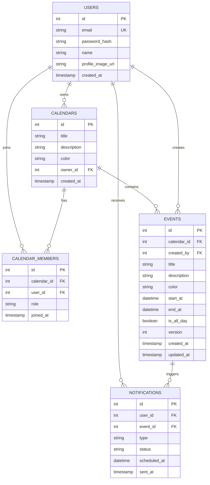

# CalBag - 공유 캘린더 서비스

Timetree를 레퍼런스로 한 공유 캘린더 백엔드 API 서비스입니다.

## 기술 스택

| 구분 | 기술 |
|------|------|
| Language | Java 17 |
| Framework | Spring Boot 3.5.14 |
| ORM | Spring Data JPA (Hibernate) |
| Database | MySQL 8.0 |
| Cache | Redis |
| Auth | Spring Security + JWT |
| Documentation | Swagger (springdoc-openapi) |
| Build | Gradle 8.14 |
| CI | GitHub Actions |

## 기술 선택 이유

- **MySQL** — 일정, 캘린더, 유저 데이터는 관계가 명확하고 영구 저장이 필요하므로 RDBMS 선택
- **Redis** — 알림 스케줄링에 사용. 1분 주기 폴링으로 발송 대상을 조회하는데, MySQL보다 메모리 기반인 Redis가 반복 조회에 적합
- **JWT** — 서버가 세션을 관리하지 않는 Stateless 인증 방식. 서버 확장 시에도 세션 공유 문제가 없음
- **낙관적 락** — 공유 캘린더 특성상 동시 수정이 빈번하지 않으므로 비관적 락 대신 낙관적 락 선택. 성능 저하 없이 충돌 감지 가능

## ERD


## API 목록

### Auth
| Method | URL | 설명 |
|--------|-----|------|
| POST | /api/auth/signup | 회원가입 |
| POST | /api/auth/login | 로그인 (JWT 발급) |

### Calendar
| Method | URL | 설명 |
|--------|-----|------|
| GET | /api/calendars | 내 캘린더 목록 조회 |
| POST | /api/calendars | 캘린더 생성 |
| PATCH | /api/calendars/{id} | 캘린더 수정 |
| DELETE | /api/calendars/{id} | 캘린더 삭제 |

### Event
| Method | URL | 설명 |
|--------|-----|------|
| GET | /api/calendars/{id}/events | 일정 목록 조회 (기간 필터) |
| POST | /api/calendars/{id}/events | 일정 생성 |
| GET | /api/events/{id} | 일정 단건 조회 |
| PUT | /api/events/{id} | 일정 수정 (낙관적 락) |
| DELETE | /api/events/{id} | 일정 삭제 |

### Notification
| Method | URL | 설명 |
|--------|-----|------|
| POST | /api/events/{id}/notification-settings | 알림 설정 |
| GET | /api/notifications | 알림 목록 조회 |
| PATCH | /api/notifications/{id}/read | 알림 읽음 처리 |

## 핵심 기능

### 1. 낙관적 락을 활용한 동시 수정 충돌 처리

공유 캘린더에서 여러 사용자가 같은 일정을 동시에 수정할 때 데이터 정합성을 보장합니다.

- JPA `@Version` 컬럼으로 수정 시마다 버전 자동 증가
- 클라이언트가 보낸 version과 DB version을 비교하여 충돌 감지
- 충돌 시 409 Conflict 응답으로 재시도 유도

### 2. Redis 기반 알림 스케줄러

일정 시작 전 사용자에게 알림을 발송하는 스케줄링 시스템입니다.

- Redis Sorted Set에 알림 예정 시각을 score로 저장
- 1분 주기 스케줄러가 현재 시각 이전의 알림을 조회하여 발송 처리
- 알림 상태 관리: PENDING → SENT → READ

### 3. N+1 문제 해결

JPA 지연 로딩으로 인한 N+1 쿼리 문제를 JPQL Fetch Join으로 해결했습니다.

- 알림 목록 조회 시 N+1 → 1 쿼리로 개선
- 캘린더 목록 조회 시 N+1 → 1 쿼리로 개선

## 트러블슈팅

### 1. 낙관적 락 version이 응답에 반영되지 않는 문제

**문제**: JPA `@Version`으로 version이 DB에서는 정상적으로 증가하지만, 수정 API 응답에서는 이전 version이 반환되는 현상 발생.

**원인**: JPA 영속성 컨텍스트가 캐시된 엔티티를 반환하여 DB에 반영된 최신 version을 읽지 못함.

**해결**: `flush()`로 DB에 즉시 반영 후 `entityManager.clear()`로 영속성 컨텍스트 캐시를 비우고 재조회하여 최신 version을 응답에 포함.

```java
eventRepository.save(event);
eventRepository.flush();
entityManager.clear();
Event updatedEvent = eventRepository.findById(eventId).get();
return new EventResponse(updatedEvent);
```

### 2. JPA @Version만으로는 순차 요청의 충돌을 감지할 수 없는 문제

**문제**: JPA `@Version`은 같은 트랜잭션 내 동시 수정만 감지. 순차적으로 들어오는 요청에서는 매번 최신 version을 DB에서 가져오기 때문에 충돌이 발생하지 않음.

**원인**: 요청마다 새 트랜잭션이 열리면서 `findById()`가 항상 최신 version을 가져옴.

**해결**: 클라이언트가 보낸 version과 DB의 현재 version을 명시적으로 비교하는 로직 추가.

```java
if (!event.getVersion().equals(request.getVersion())) {
    throw new BusinessException("다른 사용자가 이미 수정했습니다.", HttpStatus.CONFLICT);
}
```

### 3. N+1 쿼리 문제

**문제**: 알림 목록 조회 시 알림 10건이면 이벤트 조회 쿼리가 10번 추가로 발생하여 총 11번의 쿼리 실행.

**원인**: `@ManyToOne(fetch = FetchType.LAZY)` 설정으로 `getEvent()` 호출 시마다 개별 SELECT 쿼리 발생.

**해결**: JPQL Fetch Join으로 연관 엔티티를 한 번의 쿼리로 함께 조회.

```java
@Query("SELECT n FROM Notification n JOIN FETCH n.event WHERE n.user.id = :userId AND n.status IN :statuses")
List<Notification> findByUserIdAndStatusIn(...);
```

### 4. 인덱스를 활용한 일정 조회 성능 개선

**문제**: 일정 목록 조회 시 calendar_id 외래키 인덱스만 사용되어 날짜 범위 필터링은 테이블에서 직접 수행.

**원인**: EXPLAIN 결과 key_len=4 (calendar_id만 인덱스 사용), Extra=Using where (행 단위 필터링).

**해결**: calendar_id, start_at, end_at 복합 인덱스 추가.

```sql
CREATE INDEX idx_events_calendar_date ON events (calendar_id, start_at, end_at);
```

**결과**: key_len=12 (세 컬럼 모두 인덱스 사용), Extra=Using index condition (인덱스 레벨 필터링)으로 개선.

## CI

GitHub Actions를 통해 main 브랜치 push 시 자동으로 빌드 및 테스트가 실행됩니다.

## 실행 방법

### 1. 사전 설치
- JDK 17
- MySQL 8.0
- Redis

### 2. DB 생성
```sql
CREATE DATABASE calendar_db CHARACTER SET utf8mb4 COLLATE utf8mb4_unicode_ci;
```

### 3. 설정 파일
`src/main/resources/application.yml` 생성 후 DB, Redis, JWT 설정 입력

### 4. 실행
```bash
./gradlew bootRun
```

### 5. API 문서
http://localhost:8080/swagger-ui/index.html