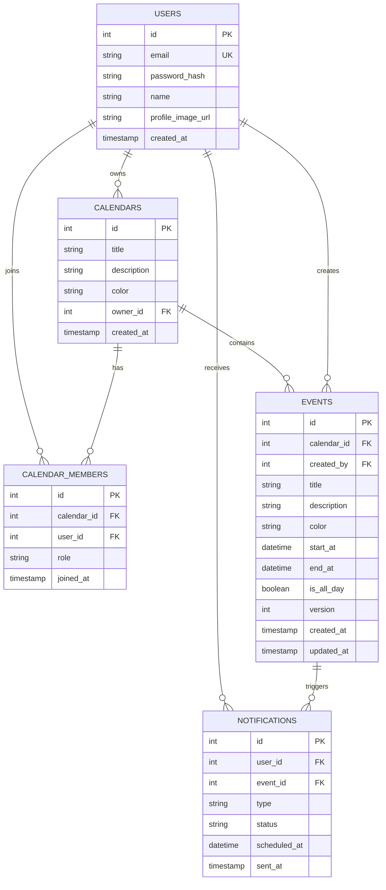

# CalBag - 공유 캘린더 서비스

여러 사용자가 캘린더를 공유하고 일정을 함께 관리할 수 있는 RESTful 백엔드 API 서버입니다.
TimeTree를 레퍼런스로, 실제 사용하며 필수적이라고 느꼈던 **동시 편집 충돌 처리**와 **일정 알림** 두 기능에 집중했습니다.

**개발 기간**: 2026.05 ~ 2026.07 (개인 프로젝트)

## 기술 스택

| 구분 | 기술 |
|------|------|
| Language | Java 17 |
| Framework | Spring Boot 3.5.14 |
| ORM | Spring Data JPA (Hibernate) |
| Database | MySQL 8.0 |
| Cache | Redis |
| Auth | Spring Security + JWT |
| Documentation | Swagger (springdoc-openapi) |
| Build | Gradle 8.14 |
| CI | GitHub Actions |

## 기술 선택 이유

- **MySQL** — 유저, 캘린더, 일정 데이터는 관계가 명확하고 영구 저장이 필요하므로 RDBMS를 선택.

- **Redis** — 알림 예정 시각을 Sorted Set의 score로 저장. score 기준 정렬이 항상 유지되므로 "현재 시각 이전의 알림"을 `O(log N + M)` 범위 조회로 가져올 수 있음 (N=전체 알림 수, M=조회된 알림 수). 발송 후 원소를 제거하면 다음 폴링 대상에서 자동 제외되어 상태 기반 필터링이 불필요함. MySQL로도 구현 가능하나, 1분 주기로 반복 실행되는 조회에는 정렬 상태를 유지하는 자료구조가 더 적합하다고 판단.

- **JWT** — 서버가 세션을 관리하지 않는 Stateless 인증 방식. 서버를 확장하더라도 세션 공유 문제가 발생하지 않음.

- **낙관적 락** — 공유 캘린더에서 동일 일정을 동시에 수정하는 경우는 드묾. 비관적 락은 조회 시점부터 락을 점유해 동시성이 떨어지므로, 충돌이 드문 상황에서는 낙관적 락이 적합하다고 판단.

## ERD



## API 목록

### Auth
| Method | URL | 설명 |
|--------|-----|------|
| POST | /api/auth/signup | 회원가입 |
| POST | /api/auth/login | 로그인 (JWT 발급) |

### Calendar
| Method | URL | 설명 |
|--------|-----|------|
| GET | /api/calendars | 내 캘린더 목록 조회 |
| POST | /api/calendars | 캘린더 생성 |
| PATCH | /api/calendars/{id} | 캘린더 수정 |
| DELETE | /api/calendars/{id} | 캘린더 삭제 |

### Event
| Method | URL | 설명 |
|--------|-----|------|
| GET | /api/calendars/{id}/events | 일정 목록 조회 (기간 필터) |
| POST | /api/calendars/{id}/events | 일정 생성 |
| GET | /api/events/{id} | 일정 단건 조회 |
| PUT | /api/events/{id} | 일정 수정 (낙관적 락) |
| DELETE | /api/events/{id} | 일정 삭제 |

<details>
<summary>일정 수정 요청/응답 예시</summary>

일정 수정 시 요청 body에 조회 시점의 `version`을 포함해야 합니다. DB의 version과 불일치하면 `409 Conflict`를 반환합니다.

**요청**

```json
PUT /api/events/1

{
  "title": "팀 회의",
  "description": "주간 회의",
  "color": "#0000FF",
  "startAt": "2026-06-10T10:00:00",
  "endAt": "2026-06-10T11:00:00",
  "isAllDay": false,
  "version": 3
}
```

**충돌 시 응답 (409 Conflict)**

```json
{
  "success": false,
  "data": null,
  "message": "다른 사용자가 이미 수정했습니다. 다시 시도해주세요."
}
```

</details>

### Notification
| Method | URL | 설명 |
|--------|-----|------|
| POST | /api/events/{id}/notification-settings | 알림 설정 |
| GET | /api/notifications | 알림 목록 조회 |
| PATCH | /api/notifications/{id}/read | 알림 읽음 처리 |

## 핵심 기능

### 1. 낙관적 락을 활용한 동시 수정 충돌 처리

공유 캘린더에서 여러 사용자가 같은 일정을 동시에 수정할 때 데이터 정합성을 보장합니다.

- JPA `@Version` 컬럼으로 수정 시마다 버전 자동 증가
- 클라이언트가 보낸 version과 DB version을 비교하여 충돌 감지
- 충돌 시 409 Conflict 응답으로 재시도 유도

### 2. Redis 기반 알림 스케줄러

일정 시작 전 사용자에게 알림을 발송하는 스케줄링 시스템입니다.

- Redis Sorted Set에 알림 예정 시각을 score로 저장
- 1분 주기 스케줄러가 현재 시각 이전의 알림을 조회하여 발송 처리
- 알림 상태 관리: PENDING → SENT → READ

## 트러블슈팅

### 1. 낙관적 락 version이 응답에 반영되지 않는 문제

**문제**: 일정 수정 API 호출 시 DB에는 version이 정상적으로 증가하지만, 응답 body에는 증가 이전의 version이 반환되었습니다. 클라이언트가 이 값으로 재수정을 시도하면 본인이 방금 수정했음에도 충돌 에러를 받게 됩니다.

**원인**: `save()` 이후 `findById()`로 재조회할 때, JPA 영속성 컨텍스트(1차 캐시)가 DB에 접근하지 않고 캐시에 남아있는 이전 엔티티를 반환하고 있었습니다.

**해결**: `flush()`로 변경사항을 DB에 즉시 반영하고, `entityManager.clear()`로 1차 캐시를 비운 뒤 재조회하도록 수정했습니다.

```java
eventRepository.save(event);
eventRepository.flush();
entityManager.clear();
Event updatedEvent = eventRepository.findById(eventId).get();
return new EventResponse(updatedEvent);
```

### 2. JPA @Version만으로는 순차 요청의 충돌을 감지하지 못하는 문제

**문제**: 동일한 version으로 두 번 연속 수정 요청을 보냈을 때, 두 번째 요청도 충돌 없이 성공했습니다. 낙관적 락이 의도대로 동작하지 않았습니다.

**원인**: `@Version`은 하나의 트랜잭션 안에서 조회한 엔티티의 version과 UPDATE 시점의 DB version을 비교합니다. HTTP 요청마다 새 트랜잭션이 열리므로 `findById()`가 항상 최신 version을 가져와 불일치가 발생하지 않았습니다.

**해결**: 클라이언트가 전달한 version과 DB의 현재 version을 서비스 레이어에서 명시적으로 비교하도록 했습니다.

```java
if (!event.getVersion().equals(request.getVersion())) {
    throw new BusinessException("다른 사용자가 이미 수정했습니다.", HttpStatus.CONFLICT);
}
```

`@Version`은 동일 트랜잭션 내의 동시 수정을, 명시적 비교는 요청 간의 충돌을 담당하여 두 계층에서 정합성을 보장합니다.

### 3. 테스트 환경 설정 파일이 메인 설정을 대체하는 문제

**문제**: 성능 측정을 위해 `src/test/resources/application.yml`에 `show-sql: false`만 작성하자 `Could not resolve placeholder 'jwt.secret'` 에러로 컨텍스트 로딩에 실패했습니다.

**원인**: 테스트 리소스의 `application.yml`은 메인 설정과 병합되지 않고 완전히 대체합니다. 누락된 `jwt`, `datasource` 설정을 찾지 못한 것이 원인이었습니다.

**해결**: 테스트용 `application.yml`에 전체 설정을 포함하고 로그 관련 옵션만 변경했습니다.

---

## 성능 개선

> 로컬 환경(MySQL 8.0)에서 더미 데이터를 삽입한 뒤 측정했습니다.
> 절대 수치보다는 개선 전후의 상대적 차이와 구조적 변화에 의미가 있습니다.

### 1. N+1 쿼리 제거

**확인**: JPA 지연 로딩 특성상 N+1이 발생할 수 있어, 알림 목록 조회의 쿼리 로그를 확인했습니다. 알림 100건 조회 시 알림 목록 1회 + 이벤트 조회 100회, 총 101회의 쿼리가 실행되고 있었습니다.

**원인**: `Notification`이 `Event`를 `@ManyToOne(fetch = FetchType.LAZY)`로 참조하고 있어, 응답 DTO 생성 과정에서 `getEvent().getTitle()`을 호출할 때마다 개별 SELECT가 발생했습니다.

**개선**: JPQL `JOIN FETCH`로 연관 엔티티를 단일 쿼리로 함께 조회하도록 변경했습니다.

```java
@Query("SELECT n FROM Notification n JOIN FETCH n.event " +
       "WHERE n.user.id = :userId AND n.status IN :statuses")
List<Notification> findByUserIdAndStatusIn(@Param("userId") Integer userId,
                                           @Param("statuses") List<NotificationStatus> statuses);
```

**결과** (알림 100건 · 워밍업 3회 후 10회 측정 평균)

| 구분 | 쿼리 횟수 | 평균 실행 시간 |
|------|----------|--------------|
| 적용 전 | 101회 | 38.78ms |
| 적용 후 | 1회 | 8.39ms |

실행 시간은 78% 단축되었습니다. 다만 더 중요한 것은 쿼리 횟수가 데이터 건수에 비례해 선형 증가하는 구조를 제거했다는 점입니다. 알림이 1,000건이었다면 1,001회의 쿼리가 발생했을 것입니다.

### 2. 복합 인덱스를 활용한 일정 조회 개선

**확인**: 일정 조회는 캘린더 앱에서 가장 빈번한 요청이므로 데이터 증가 시의 동작을 확인했습니다. 일정 10만 건을 삽입한 뒤 EXPLAIN으로 실행 계획을 분석했습니다.

**원인**: `calendar_id` 외래키 인덱스만 사용되고 있었습니다(`key_len=4`, `Extra=Using where`). 해당 캘린더의 전체 일정 2,000건을 읽은 뒤 날짜 조건으로 필터링하는 구조로, 실제 필요한 행은 217건이었습니다.

**개선**: `(calendar_id, start_at, end_at)` 복합 인덱스를 추가해 인덱스 레벨에서 날짜 범위까지 필터링하도록 했습니다. 인덱스는 엔티티에 선언해 스키마와 함께 관리됩니다.

```java
@Table(
    name = "events",
    indexes = @Index(name = "idx_events_calendar_date",
                     columnList = "calendar_id, start_at, end_at")
)
public class Event { ... }
```

**결과** (일정 10만 건 · 동일 쿼리 3회 실행 후 안정값)

| 구분 | key_len | Extra | 실행 시간 |
|------|---------|-------|----------|
| FK 인덱스만 | 4 | Using where | 4.7ms |
| 복합 인덱스 | 12 | Using index condition | 1.2ms |

실행 시간이 74% 단축되었습니다. `key_len`이 4에서 12로 증가한 것은 `INT` 타입 세 컬럼이 모두 인덱스로 활용되었음을 의미합니다.

---

## 테스트

- 낙관적 락 충돌 감지 (version 일치 / 불일치)
- 캘린더 권한 검증 (VIEWER 권한의 일정 수정 차단)
- N+1 쿼리 발생 여부 및 Fetch Join 적용 전후 성능 비교

```bash
./gradlew test
```

## CI

GitHub Actions를 통해 main 브랜치 push 시 자동으로 빌드 및 테스트가 실행됩니다.

## 실행 방법

### 1. 사전 설치
- JDK 17
- MySQL 8.0
- Redis

### 2. DB 생성

```sql
CREATE DATABASE calendar_db CHARACTER SET utf8mb4 COLLATE utf8mb4_unicode_ci;
```

### 3. 설정 파일

`src/main/resources/application.yml` 생성 후 DB, Redis, JWT 설정 입력

### 4. 실행

```bash
./gradlew bootRun
```

### 5. API 문서

http://localhost:8080/swagger-ui/index.html